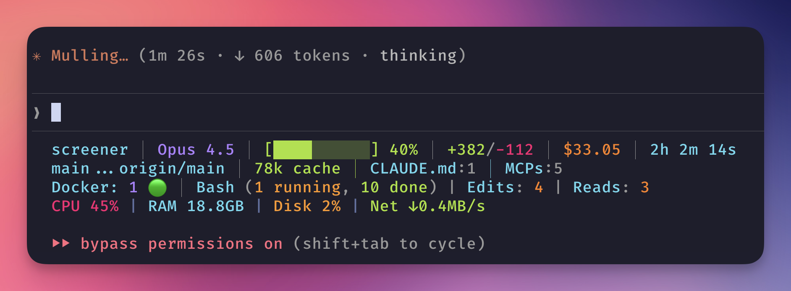

<div align="center">

  

  # claude-scope

  ### Real-time statusline for Claude Code CLI

  [](https://www.npmjs.com/package/claude-scope)
  [](https://www.npmjs.com/package/claude-scope)
  [](LICENSE.md)
  [](https://github.com/YuriNachos/claude-scope)
  [](https://codecov.io/gh/YuriNachos/claude-scope)
  [](https://github.com/YuriNachos/claude-scope)

  **Track context, cost, git, docker, and more — right in your terminal**

  [Quick Start](#-quick-start) · [Features](#-features) · [Themes](#-themes) · [Configuration](#-configuration) · [Documentation](#-documentation)

</div>

---

<div align="center">
  
  <br/>
  <sub>claude-scope in action — model, context, cost, git, docker, system metrics and more</sub>
</div>

---

## Why claude-scope?

**claude-scope** transforms your Claude Code CLI into a powerful command center. See everything you need at a glance:

| What you get | Why it matters |
|--------------|----------------|
| **Context usage** | Know when you're running low before it's too late |
| **Session cost** | Track spending in real-time |
| **Git status** | Branch, changes, tags — no switching windows |
| **Docker containers** | Monitor your stack without leaving the terminal |
| **Active tools** | See what Claude is doing right now |
| **System metrics** | CPU, RAM, disk, network — all in one place |

---

## Highlights

- **Zero runtime dependencies** — pure TypeScript, native Node.js only
- **15 customizable widgets** — model, context, cost, git, docker, sysmon, and more
- **17 built-in themes** — from Dracula to Nord to Cyberpunk
- **12 display styles** — balanced, playful, compact, verbose, technical...
- **AI-friendly configuration** — just ask Claude to customize it!
- **Instant setup** — one command, works immediately

---

## Quick Start

```bash
npx -y claude-scope@latest install
```

This single command:
1. Adds statusLine to `~/.claude/settings.json`
2. Opens interactive configurator to choose layout, theme, and style

Restart Claude Code — done!

### Reconfigure anytime

```bash
npx -y claude-scope@latest quick-config
```

<details>
<summary>Manual installation</summary>

Add to your `~/.claude/settings.json`:

```json
{
  "statusLine": {
    "type": "command",
    "command": "npx -y claude-scope@latest",
    "padding": 0
  }
}
```

</details>

---

## Features

### Available Widgets

| Widget | Description | Example |
|--------|-------------|---------|
| **model** | Current Claude model | `Opus 4.5` |
| **context** | Context usage with progress bar | `42% [████████░░░░░░░░░]` |
| **cost** | Session cost | `$33.05` |
| **duration** | Session time | `2h 10m 20s` |
| **lines** | Lines added/removed | `+382/-112` |
| **git** | Branch and tracking | `main...origin/main` |
| **git-tag** | Latest tag | `v0.8.49` |
| **cache-metrics** | Cache statistics | `81k cache` |
| **config-count** | Config files count | `CLAUDE.md:1 │ MCPs:5` |
| **active-tools** | Running/completed tools | `Bash (1 running, 10 done)` |
| **dev-server** | Dev server status | `⚡ Nuxt (running)` |
| **docker** | Docker containers | `Docker: 1 🟢` |
| **sysmon** | System metrics | `CPU 45% │ RAM 19GB │ Disk 2%` |
| **poker** | Easter egg | `🃏 A♠ K♠` |
| **cwd** | Current directory | `~/projects/app` |

### Layout Presets

| Preset | Lines | Best for |
|--------|-------|----------|
| **Rich** | 4 | Full information, large terminals |
| **Balanced** | 2 | Most users, good balance |
| **Compact** | 1 | Minimal footprint |

---

## Themes

<div align="center">
  
  <br/>
  <sub>Same data, different themes — find your style</sub>
</div>

### 17 Built-in Themes

| Category | Themes |
|----------|--------|
| **Popular** | `dracula`, `tokyo-night`, `nord`, `monokai` |
| **IDE** | `vscode-dark-plus`, `one-dark-pro`, `github-dark-dimmed` |
| **Pastel** | `catppuccin-mocha`, `rose-pine` |
| **Vibrant** | `cyberpunk-neon` |
| **Professional** | `professional-blue`, `solarized-dark` |
| **Minimal** | `gray`, `muted-gray`, `slate-blue`, `dusty-sage` |
| **Semantic** | `semantic-classic` |

Switch themes instantly:
```bash
npx -y claude-scope@latest quick-config
# → Select "Theme" → Choose from 17 options
```

---

## Configuration

### AI-Powered Customization

**claude-scope is built to work with AI!** Just ask Claude:

```
"Add the docker widget to line 3"
"Switch theme to nord"
"Make it more playful"
"Show only model and context"
"Add system monitoring"
```

Claude automatically edits `~/.claude-scope/config.json` — changes take effect instantly.

**How it works:**
- Config contains `$aiDocs` field linking to [AI-CONFIG-GUIDE.md](AI-CONFIG-GUIDE.md)
- AI understands all 15 widgets, 12 styles, and 17 themes
- Natural language → instant configuration

### Manual Configuration

Edit `~/.claude-scope/config.json` directly:

```json
{
  "version": "1.0.0",
  "$aiDocs": "https://github.com/YuriNachos/claude-scope/blob/main/AI-CONFIG-GUIDE.md",
  "lines": {
    "0": [
      { "id": "model", "style": "balanced", "colors": { ... } },
      { "id": "context", "style": "balanced", "colors": { ... } }
    ],
    "1": [
      { "id": "git", "style": "balanced", "colors": { ... } }
    ]
  }
}
```

See [AI-CONFIG-GUIDE.md](AI-CONFIG-GUIDE.md) for complete reference with all widgets, styles, and color codes.

---

## Documentation

| Topic | Description |
|-------|-------------|
| [AI-CONFIG-GUIDE.md](AI-CONFIG-GUIDE.md) | Complete configuration reference for AI assistants |
| [ARCHITECTURE.md](docs/ARCHITECTURE.md) | System architecture, data flow, providers |
| [WIDGETS.md](docs/WIDGETS.md) | All widgets, styles, examples |
| [THEME-SYSTEM.md](docs/THEME-SYSTEM.md) | Theme system, customization |
| [FORMATTERS.md](docs/FORMATTERS.md) | Formatters, ANSI colors |
| [CHANGELOG.md](docs/CHANGELOG.md) | Version history, roadmap |

---

## Requirements

- **Node.js** 18+
- **Claude Code** CLI

---

## Contributing

Contributions are welcome! See [CONTRIBUTING.md](CONTRIBUTING.md) for guidelines.

---

## License

[MIT](LICENSE.md) — use freely in your projects.

---

<div align="center">

  **Made with ❤️ by [YuriNachos](https://github.com/YuriNachos)**

  [GitHub](https://github.com/YuriNachos/claude-scope) · [Issues](https://github.com/YuriNachos/claude-scope/issues) · [npm](https://www.npmjs.com/package/claude-scope)

  <br/>

  If you find claude-scope useful, consider giving it a ⭐

</div>
